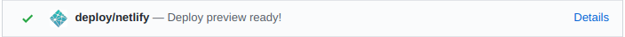

Sources of the main [mlr website](https://mlr-web.netlify.com/) including the blog post sources.

`blogdown` and Hugo are used to render the site. Deployment is done via Netlify.

It is highly recommended to use **RStudio** for tasks in this repo. 
It integrates very well with the live preview of `blogdown`.

# How to add a new blog post

1. Add yourself as an author to https://github.com/mlr-org/mlr/wiki/Misc#mlr-developer-team-and-contributors-page and create an "author page" for the website (similar to the ones in `data/authors`).

1. Create a new post in `content/post/` via `blogdown::new_post(title = "<title>", categories = "R", ext = ".Rmd")`

1. Put external images in `static/images/<name of your post>`.

1. Run `git submodule update --init --recursive` from the repo root to clone the Hugo theme.

1. Preview your post by running `blogdown::serve_site()`.

1. Commit the **Rmd and HTML** file and possible external resources.

1. Open a Pull Request. You can preview the changes you made by clicking on "Details" of your opened PR on Github:

